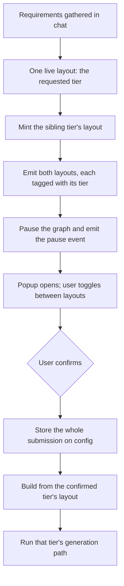
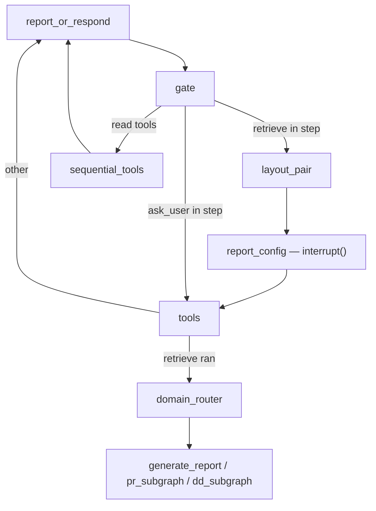
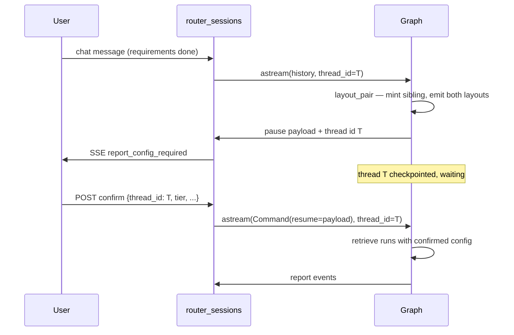

# Report Config Interrupt - Plan

## Goal Capsule

- **Objective:** Put a real pause between "requirements gathered" and "report generated", so the user picks the report tier and configuration on a frontend popup — with both a brief and a study layout in front of them — and retrieval runs only on their confirmation.
- **Product authority:** The Confirm submission is the authority for report tier. The model's own tier argument and the pre-paid tier lock do not override it.
- **Target tree:** `src/app/**` only. `src/app/research/agent/model.py` is the live agent (`src/app/chats/router_sessions.py:63` imports it). The untracked `src/core/agent/model.py`, `src/app/cards/card_utils.py`, and `src/resources/routers/api.py` are pre-migration copies — do not edit them.
- **Execution profile:** Behavior-first. The pause, the resume, and the tier authority each need a test that proves the path; tone work is prompt-only.
- **Stop conditions:** Stop and ask if the frontend contract must change shape beyond the payload defined in U5, or if the Postgres checkpointer cannot use the existing database.
- **Tail ownership:** Not specified — follow repo conventions for branching and landing.

**Product Contract preservation:** unchanged. Planning added the Planning Contract, Implementation Units, Verification Contract, and Definition of Done below.

---

## Product Contract

### Summary

Caspr pauses before every retrieval, tells the frontend it is paused, and waits for a configuration submission. At that pause the user sees both a brief and a study layout for their request and picks one; the confirmed tier decides which layout the report is built from and which generation path runs.

### Problem Frame

Today the tier is decided twice, by parties that cannot see each other. The model guesses `study` or `brief` from the wording of the conversation and passes it to retrieval, where a pre-paid tier silently overrides the guess. The user never states the tier directly, and never sees what the other tier's report would have looked like.

The layout compounds this. A layout is proposed early and refined through conversation, and its shape is tier-specific — study layouts carry bullet subsections, brief layouts are flat and capped at five sections. So the layout the user spent the conversation refining is already committed to a tier before anyone asked them which tier they wanted.

There is also no genuine pause anywhere in the flow. Asking the user a question is simulated: the graph runs to completion, emits an options event, and patches the system prompt to talk the model out of calling another tool. Retrieval is expensive and effectively irreversible once started, which makes it the one place where a real, durable pause is worth having.

### Key Decisions

- KD1. **The popup is the interrupt's own UI.** One pause, one form, one submission — not a tier popup followed by a separate configuration step. (session-settled: user-directed — chosen over two sequential screens: one confirmation point is enough, and the graph should pause once.) Governs R1, R2, R3.
- KD2. **A pause event accompanies the pause.** The frontend is told the graph is waiting rather than inferring it. Governs R2.
- KD3. **Minimum native interrupt.** Use LangGraph's own interrupt and resume for this one pause, and leave the existing `ask_user` simulation alone. (session-settled: user-directed — chosen over an event-gated fake pause and over a full human-in-the-loop rewrite: the resume must carry real submitted values, but replacing every simulated pause is a much larger change than this feature.) Governs R1, R3, R4.
- KD4. **One live layout during the conversation; the sibling is minted at the pause.** (session-settled: user-directed — chosen over generating both layouts at the first proposal: with two layouts live in the conversation, a later refinement request cannot be attributed to either one.) Governs R5, R6, R8.
- KD5. **The confirmed tier is the only tier authority.** (session-settled: user-directed — chosen over keeping the paid-tier override: the user's explicit selection is a stronger signal than a tier inferred before the layout existed.) Governs R10.
- KD6. **Brief is available on every domain.** (session-settled: user-directed — chosen over keeping due diligence study-only: a tier the popup offers must be a tier the pipeline can produce.) Governs R11.
- KD7. **Confirmation is the only resume.** A chat message sent while the graph is paused does not resume it. (session-settled: user-directed — chosen over defining a second resume path: one entry point keeps the paused state unambiguous in v1.) Governs R3.
- KD8. **Every submitted field is persisted, even the inert ones.** (session-settled: user-directed — chosen over dropping fields v1 does not act on: storing them now means the later features read configuration instead of re-deriving it.) Governs R12, R13.
- KD9. **The backend defines the pause-event and Confirm-payload shape; the frontend conforms.** (session-settled: user-directed — chosen over settling the contract with the frontend first: the pause and its payload originate in the graph, so the graph names the fields.) Governs R2, R3.

### Actors

- A1. **User** — gathers requirements in chat, then picks tier and configuration on the popup and confirms.
- A2. **Caspr graph** — proposes layouts, pauses before retrieval, resumes on the confirmed configuration, and generates the report.
- A3. **Frontend** — opens the popup on the pause event, renders both layouts, toggles between them, and submits the configuration.

### Key Flows

- F1. Confirming the tier that was already live
  - **Trigger:** Requirements are complete and retrieval is about to run.
  - **Actors:** A1, A2, A3
  - **Steps:** Caspr mints the other tier's layout, emits both tagged layouts, pauses, and emits the pause event. The user confirms the tier that was live all along. Caspr stores the submission and builds the report from that layout.
  - **Outcome:** The report matches the layout the user refined in conversation.
  - **Covers R1, R2, R5, R6, R7, R9, R12.**

- F2. Switching tiers at the pause
  - **Trigger:** As F1, but the user confirms the other tier.
  - **Actors:** A1, A2, A3
  - **Steps:** The user toggles to the sibling layout, sees it, and confirms it. Caspr builds the report from the sibling layout and runs that tier's generation path.
  - **Outcome:** The switch costs nothing extra at confirm time, because the sibling layout was already produced and refreshed before the pause.
  - **Covers R6, R8, R9, R14.**

### Requirements

**Pause and resume**

- R1. Retrieval does not begin until the graph has paused for configuration and been resumed with a confirmed submission.
- R2. When the graph pauses, Caspr emits an event that tells the frontend it is waiting for configuration.
- R3. The only thing that resumes a paused graph is a Confirm submission carrying the configuration payload; a chat message sent while paused does not resume it.
- R4. A paused chat stays paused across requests and resumes without replaying the conversation.

**The layout pair**

- R5. Exactly one layout is live while requirements are being gathered — the tier the user asked for, defaulting to study — so every refinement in conversation applies to an unambiguous layout.
- R6. Before pausing, Caspr produces the other tier's layout through the same propose-and-web-refresh flow the live layout went through, so both layouts are current when the popup opens.
- R7. Each emitted layout states which tier it represents.
- R8. Toggling between the two layouts is display-only: it does not change which layout is live and does not inform the model.
- R9. The layout selected per R10 is used in its web-refreshed form when the refresh produced one.

**Tier authority**

- R10. The Tier in the confirmed submission is the sole authority for brief versus study: it selects the layout the report is built from and the generation path that runs, overriding both the model's tier argument and any pre-paid tier.
- R11. Brief is available on every domain, including due diligence.

**Configuration persistence**

- R12. Every field of the confirmed submission — tier, output formats, language, style, and data sources — is stored on the report configuration.
- R13. Only tier and style change behavior in v1. Output formats, language, and data sources are stored and otherwise inert.

**Card tone**

- R14. Card generation writes for an investor audience: an investor is the reader the report is being produced for, and the card prompts adopt the register that reader expects. Investor is the only style v1 accepts (per R13).

### Acceptance Examples

- AE1. Tier switch at the pause
  - **Covers R6, R9, R10.**
  - **Given** a study layout was refined in conversation and a brief sibling was minted at the pause,
  - **When** the user confirms brief,
  - **Then** the report is built from the brief layout and the brief generation path runs.

- AE2. Confirmation beats the paid tier
  - **Covers R10.**
  - **Given** the chat was charged as a study,
  - **When** the user confirms brief,
  - **Then** brief is what gets generated.

- AE3. Brief on due diligence
  - **Covers R11.**
  - **Given** the request routes to due diligence,
  - **When** the user confirms brief,
  - **Then** a brief due diligence report is generated rather than a rejection or a silent upgrade to study.

- AE4. Chat message while paused
  - **Covers R3, R4.**
  - **Given** the graph is paused for configuration,
  - **When** the user sends an ordinary chat message,
  - **Then** retrieval does not start and the graph is still paused, waiting for a confirmation.

- AE5. Toggling without confirming
  - **Covers R8.**
  - **Given** the popup is open with both layouts,
  - **When** the user toggles between them repeatedly without confirming,
  - **Then** no layout is re-proposed, the model is not told about the toggling, and the graph stays paused.

### Scope Boundaries

- Acting on output formats, data sources, non-English languages, or any style other than investor. v1 stores those values only (R13).
- Resuming a paused graph from an ordinary chat message (KD7).
- Replacing the simulated `ask_user` pause with a native interrupt (KD3).
- Refining a layout after both layouts have been shown. Refinement happens in conversation, before the pause.

#### Deferred to Follow-Up Work

- Deleting the hand-rebuilt message history in `get_processing_state` in favor of checkpointer-owned history. KTD4 deliberately scopes the checkpointer thread around the pause so this migration stays out of scope.
- Removing the pre-migration copies (`src/core/agent/model.py`, `src/app/cards/card_utils.py`, `src/resources/routers/api.py`) and the four unused `CARD_GEN_PROMPT_*` constants.

### Dependencies / Assumptions

- The pause needs graph state that survives between requests; the live graph is compiled without a checkpointer (`src/app/research/agent/model.py:4565`), so durable pause state is a prerequisite for R4, not an optimization.
- The frontend owns the popup: rendering both layouts, the tier toggle, and the Confirm submission. This plan assumes it is built alongside.
- The layouts are assumed to remain tier-shaped as they are today — study carries bullet subsections, brief is flat and capped at five sections — which is why a tier switch needs a different layout rather than a re-render of the same one.
- Due diligence is study-only by prompt and normalization rules rather than by a pipeline limitation, so allowing brief there is a matter of relaxing those rules.

### Outstanding Questions

**Deferred to Planning**

- The allowed values for output formats and data sources. These stay open by choice; R12 and R13 keep them inert, so nothing downstream needs the enumerations yet.

### Sources / Research

- `src/app/research/agent/model.py` — the live agent. Layout proposal (`propose_report_layout`, line 2248) and its background refresh (`update_proposed_report_layout`, line 2361); the retrieval entry point (`retrieve`, line 1935); the tool-step gate (`_gate_node`, line 3834) and its routing (`_route_after_gate`, line 3980); graph construction (`_build_graph`, line 4460); the per-turn history rebuild and stream entry (`get_processing_state`, line 4693).
- `src/app/research/agent/refine_request_router.py:293,433` — the repo's only existing LangGraph checkpointer usage: a per-instance saver with a `thread_id` taken from the report id. Precedent for KTD3 and KTD4.
- `src/app/research/prompts/prompt_utils.py:186,214` — `build_card_gen_prompt` composes the study card prompt and appends the shared `CASPR_VOICE` block; the single leverage point for R14 on the study path.
- `langgraph-jugaad-to-native.md` (present in both `src/core/agent/` and `src/app/agent/`) — inventory of hand-rolled workarounds and their native replacements. Its H1 entry (simulated `ask_user`) and S1 entry (no checkpointer) are the background for KD3 and R4.

---

## Planning Contract

### Key Technical Decisions

- KTD1. **The interrupt lives in its own side-effect-free node, `report_config`, placed between `gate` and `tools`.** On resume, LangGraph re-executes the interrupted node from its first line, so any node holding the interrupt must be safe to run twice. A dedicated node that only builds a payload and calls `interrupt()` is trivially safe. Calling `interrupt()` inside `retrieve` would re-run retrieve's preamble; `interrupt_before=["tools"]` would also pause `ask_user`, which must keep its current behavior per KD3. Governs R1, R3.
- KTD2. **Sibling-layout minting lives in a separate node, `layout_pair`, ahead of the pause.** Nodes before the interrupted node do not re-execute on resume, so the sibling is minted and its events emitted exactly once. Putting this work inside `report_config` would re-mint and re-emit on every resume. Governs R6, R7.
- KTD3. **Durable pause state via `AsyncPostgresSaver` on the existing database, set up once at application startup.** `MemorySaver` is the repo's existing precedent but is per-object and in-process, so a paused report would not survive a restart or reach a second worker — which R4 requires. Note the DSN mismatch: `DB_CONNECTION_LINK` (`src/app/core/constants.py:247`) is an asyncpg URL and the Postgres saver uses psycopg, so the saver needs its own psycopg DSN built from the same credentials. Governs R4.
- KTD4. **The checkpointer thread is scoped to the pause, not to the chat.** `get_processing_state` rebuilds the whole conversation every turn; if the thread were keyed by `chat_id`, each turn's rebuilt history would append on top of checkpointed history and duplicate messages through the `messages` reducer. A per-turn thread id keeps the checkpointer as pause storage only and leaves the history rebuild untouched. The id is minted at turn start, carried in the pause event, and echoed by the Confirm submission. Governs R4.
- KTD5. **Retrieval reads the tier from the resumed configuration and ignores its own `report_type` argument and `forced_report_type`.** The override block at `src/app/research/agent/model.py:2037-2044` is removed rather than reordered, so there is one tier authority instead of two. Governs R10.
- KTD6. **Due-diligence brief is unblocked at every enforcement point rather than only in the agent.** The rule is stated in the prompts and re-applied defensively in the routers, so relaxing one place leaves the others to silently re-upgrade the tier. Governs R11.
- KTD7. **Style threads through `build_card_gen_prompt` and `BRIEF_SYSTEM_PROMPT` only.** These are the two prompts the live card paths actually use (`src/app/cards/service_cards.py:1001,1567,1861`). The four `CARD_GEN_PROMPT_*` constants are defined but never referenced; editing them would change nothing. Governs R14.
- KTD8. **The whole Confirm payload lands on `self.retrieve_config` in one write.** Tier and style are read from it; the rest is stored and unread, so adding behavior later needs no new plumbing. Governs R12, R13.
- KTD9. **The pause event and the resume endpoint are added to `src/app/chats/router_sessions.py`.** That is the mounted stream loop (`src/app/api.py:13,27`). `src/resources/routers/api.py` carries similar code but is staged for deletion and is not mounted. Governs R2, R3.

### High-Level Technical Design

Graph shape. Two nodes and one routing branch are added; every existing edge is preserved.

`_route_after_gate` currently returns `"tools"` when the step contains either `retrieve` or `ask_user` (`src/app/research/agent/model.py:4033`). It gains a prior branch: a step containing `retrieve` routes to `layout_pair`; `ask_user` keeps routing straight to `tools`.

Pause and resume across two requests.

Two properties matter. The first request ends with the graph parked, not finished — the stream terminates but the thread is resumable. The second request carries no conversation input at all, only the resume command plus the thread id, which is what makes R4's "without replaying the conversation" true.

### Assumptions

- LangGraph 1.x re-executes only the interrupted node on resume; nodes that completed before it do not re-run. KTD1 and KTD2 both rest on this. Verify against the installed version before building U3 and U4 — it is the single assumption that would reshape the node split.
- The existing per-request `Casper` construction stays. A resume builds a fresh `Casper` and a fresh graph; only checkpointed graph state carries over, so anything the resumed path needs must be in graph state or reconstructible from the database.
- `interrupt()` requires a checkpointer, so U1 genuinely blocks U4 rather than merely preceding it.

### Sequencing

U1 and U2 establish durable pause state and thread identity. U3 and U4 add the two nodes and the routing branch. U5 exposes the pause and the resume to the frontend, which is the first point the feature is observable end to end. U6 makes the confirmed tier authoritative. U7 and U8 are independent of the pause machinery and can land in any order.

---

## Implementation Units

### U1. Durable checkpointer on the agent graph

- **Goal:** The graph can pause and be resumed in a later request.
- **Requirements:** R4
- **Dependencies:** none
- **Files:**
  - `src/app/research/agent/model.py` (modify — `_build_graph` compile at line 4565)
  - `src/app/core/checkpointer.py` (create — saver construction and lifecycle)
  - `src/app/main.py` (modify — build the saver and run its one-time setup in the lifespan)
  - `src/app/core/constants.py` (modify — psycopg DSN alongside the existing asyncpg `DB_CONNECTION_LINK`)
  - `tests/test_report_config_checkpointer.py` (create)
- **Approach:** Per KTD3. Steps:
  1. Add a module that returns a process-wide `AsyncPostgresSaver` built from a psycopg DSN, with an in-memory saver used when the database is unavailable so tests and local runs still work.
  2. Call the saver's one-time setup in the application lifespan, not per request — repeated setup per request is the failure this ordering avoids.
  3. Pass the saver into `compile()`.
- **Patterns to follow:** `src/app/research/agent/refine_request_router.py:293,358,433` for saver-plus-`thread_id` shape; `src/app/core/db.py` (`build_engine`/`set_engine`) for the build-once-at-startup pattern.
- **Test scenarios:**
  - A graph compiled with the saver reports a resumable thread after an interrupt, and the same thread id returns the stored state on a second lookup.
  - With no reachable database, saver construction falls back to the in-memory saver instead of raising, and the fallback is logged.
  - Setup runs once across repeated graph construction for the same process.
- **Verification:** A paused thread created in one graph instance is discoverable from a second graph instance built in the same process.

### U2. Pause thread identity

- **Goal:** A paused turn has a stable id that the frontend can hand back to resume it.
- **Requirements:** R3, R4
- **Dependencies:** U1
- **Files:**
  - `src/app/research/agent/model.py` (modify — mint and expose the id; pass `config={"configurable": {"thread_id": ...}}` at the `astream` call, line 4762)
  - `src/app/chats/router_sessions.py` (modify — persist and look up the id)
  - `tests/test_report_config_checkpointer.py` (modify)
- **Approach:** Per KTD4. Mint a `uuid7` per turn, pass it as the graph `thread_id`, and persist it against the chat with a TTL so the Confirm request can find it. Keep `get_processing_state`'s history rebuild exactly as is — this unit must not change how history is assembled.
- **Patterns to follow:** existing Redis keying in `src/app/chats/router_sessions.py` (`chat:{chat_id}:...` with an expiry) for the pending-thread record; `from uuid import uuid7` per the repo's UUIDv7 rule.
- **Test scenarios:**
  - Two consecutive ordinary turns in one chat use different thread ids and the second turn's messages are not duplicated by the reducer.
  - A paused turn's thread id is retrievable for that chat after the request that created it has ended.
  - The pending-thread record expires, and a Confirm arriving after expiry is rejected rather than starting an unconfigured retrieval.
- **Verification:** A resume using the persisted id reaches retrieval; a resume using an unknown id is refused.

### U3. `layout_pair` node — mint and emit both tier layouts

- **Goal:** Both a brief and a study layout exist and are emitted, each tagged with its tier, before the pause.
- **Requirements:** R5, R6, R7, R8
- **Dependencies:** none (independent of U1; ordered before U4 in the graph)
- **Files:**
  - `src/app/research/agent/model.py` (modify — new node method; reuse `_await_layout_refresh` line 520 and the propose/refresh pair at lines 2248 and 2361)
  - `tests/test_report_config_layout_pair.py` (create)
- **Approach:** Per KTD2, this node runs before the interrupt and must leave the conversation's live layout alone (R8).
  1. Await the in-flight refresh of the live layout so the emitted pair is current (R6).
  2. Determine the live tier, derive the sibling tier, and produce the sibling layout through the same propose-and-refresh path.
  3. Emit both layouts as events carrying an explicit tier field (R7), and record both on the instance for the resumed path to select from.
  4. Do not rewrite the `propose_report_layout` tool message in history for the sibling — the live layout stays the one the model sees (R8).
- **Patterns to follow:** `propose_report_layout` (line 2248) for event shape and the S3 debug upload; `update_proposed_report_layout` (line 2361) for the refresh call and its never-raise posture; `_spawn_background_task` (line 513) for background work.
- **Test scenarios:**
  - Live layout is study: the node emits two layouts, one tagged study and one tagged brief, and the brief one is flat with no bullet subsections.
  - Live layout is brief: the node emits a study sibling carrying bullet subsections.
  - The sibling layout's refresh fails: the node still emits both layouts and the un-refreshed sibling is used, with no exception escaping.
  - The node does not add or rewrite a `propose_report_layout` tool message for the sibling, so `_layout_ever_proposed` and the model's view of the live layout are unchanged.
  - Running the node twice for the same turn does not emit four layouts.
- **Verification:** Both tagged layouts appear in the custom event stream before any pause payload, and message history is byte-identical to a run without the node except for the sibling's absence from it.

### U4. `report_config` interrupt node and the gate routing branch

- **Goal:** The graph pauses before retrieval and resumes only with a submitted configuration.
- **Requirements:** R1, R2, R3
- **Dependencies:** U1, U3
- **Files:**
  - `src/app/research/agent/model.py` (modify — new node; `_route_after_gate` line 3980; `_build_graph` nodes and edges lines 4460-4565)
  - `tests/test_report_config_interrupt.py` (create)
- **Approach:** Per KTD1. The node builds a payload and calls `interrupt()`; it holds no other work, so re-execution on resume is harmless.
  1. Register `layout_pair` and `report_config` as nodes; edge `layout_pair` to `report_config` and `report_config` to `tools`.
  2. In `_route_after_gate`, route a step containing `retrieve` to `layout_pair` before the existing `retrieve`-or-`ask_user` branch, leaving `ask_user` routed to `tools`.
  3. Emit the pause event (R2), then interrupt with a payload carrying the thread id, both tagged layouts, and the live tier as the default selection.
  4. Return the resumed value into state so U6 can read it.
- **Execution note:** Write the pause-and-resume test before the node. The re-execution semantics in Assumptions are the load-bearing risk, and a failing test is the cheapest way to confirm them against the installed LangGraph.
- **Patterns to follow:** `_route_after_gate` (line 3980) for the answered-tool-call guard that must keep working; `ask_user` (line 2194) for event-then-return shape.
- **Test scenarios:**
  - A step containing `retrieve` routes to `layout_pair`, not straight to `tools`.
  - A step containing only `ask_user` still routes straight to `tools` and its existing behavior is unchanged.
  - Covers AE4. While the thread is interrupted, retrieval has not run and the thread still reports as awaiting input.
  - Resuming with a configuration payload returns that payload from `interrupt()` and proceeds into `tools`.
  - The node re-executing on resume does not emit a second pause event.
  - A layout-guard nudge step (no real retrieve call) does not reach `layout_pair`.
- **Verification:** With the node in place, a report request halts with no retrieval side effects, and a resume drives the same turn to report generation.

### U5. Pause event to the frontend and the resume endpoint

- **Goal:** The frontend learns the graph is paused and can submit the configuration that resumes it.
- **Requirements:** R2, R3, R4
- **Dependencies:** U2, U4
- **Files:**
  - `src/app/chats/router_sessions.py` (modify — SSE branch for the pause event in the stream loop; new Confirm endpoint)
  - `tests/smoke/baseline_routes.json` (modify — new route in the inventory baseline)
  - `tests/test_report_config_resume.py` (create)
- **Approach:** Per KTD9. The pause event becomes an SSE type carrying the thread id, both tagged layouts, and the default tier. The Confirm endpoint validates the payload, looks up the pending thread, and streams the resumed run using the same event-forwarding loop as an ordinary turn.
  1. Add the SSE branch alongside the existing `report_layout` and `report_type` branches.
  2. Add the endpoint; on a valid submission, stream `Command(resume=payload)` against the stored thread id.
  3. Reject a Confirm for a chat with no pending pause, and a Confirm whose thread id does not match the stored one.
- **Patterns to follow:** the `report_layout` SSE branch and the `redis_instance.redis_client.xadd(stream_key, ...)` shape in `src/app/chats/router_sessions.py`; existing request-model and auth conventions on that router's chat endpoints.
- **Test scenarios:**
  - The pause event reaches the stream as its own SSE type and carries the thread id plus both tagged layouts.
  - A valid Confirm resumes the run and report events follow on the stream.
  - A Confirm for a chat with no pending pause is rejected without starting retrieval.
  - A Confirm carrying a stale or unknown thread id is rejected.
  - Covers AE4. An ordinary chat message posted while the chat is paused does not resume it and does not start retrieval.
  - The route inventory smoke test passes with the new endpoint recorded in the baseline.
- **Verification:** A full request-pause-confirm-report cycle runs across two HTTP requests.

### U6. Confirmed tier as the only tier authority

- **Goal:** The confirmed tier selects the layout and the generation path, and the whole submission is stored.
- **Requirements:** R9, R10, R12, R13
- **Dependencies:** U4
- **Files:**
  - `src/app/research/agent/model.py` (modify — `retrieve` line 1935, including the override block at lines 2037-2044 and the `retrieve_config` writes at lines 2047-2054)
  - `tests/test_report_config_tier_authority.py` (create)
- **Approach:** Per KTD5 and KTD8.
  1. Read the resumed configuration in `retrieve`; treat its tier as authoritative and ignore both the `report_type` argument and `forced_report_type`.
  2. Delete the override block rather than reordering it, so only one tier authority remains.
  3. Select the confirmed tier's layout from the pair recorded in U3, then apply the existing web-refreshed substitution to it (R9).
  4. Write the whole payload onto `self.retrieve_config` in one place; read only tier and style from it.
- **Patterns to follow:** the existing `retrieve_config` assignment block (lines 2047-2054), where `report_language` is already pinned to English (line 2051) — the same shape the stored-but-inert fields take.
- **Test scenarios:**
  - Covers AE1. Confirming brief when study was live builds from the brief layout and takes the `generate_brief_cards` path.
  - Covers AE2. With `forced_report_type` set to study, confirming brief still produces brief.
  - A confirmed tier that disagrees with the model's `report_type` argument resolves to the confirmed tier.
  - Covers R9. When the refresh produced an updated version of the confirmed tier's layout, that version is what the report is built from.
  - Output formats, language, and data sources are present on `retrieve_config` after retrieval and change no branch taken (R13).
- **Verification:** Both tiers reach their own generation path purely from the confirmed value, with no other input able to change it.

### U7. Allow brief on due diligence

- **Goal:** A confirmed brief on the due-diligence domain produces a brief.
- **Requirements:** R11
- **Dependencies:** none
- **Files:**
  - `src/app/research/prompts/prompt_utils.py` (modify — lines 1117, 1311, 1322, 1348)
  - `src/app/chats/router_sessions.py` (modify — lines 951, 991)
  - `src/app/reports/router_reports.py` (modify — line 862)
  - `tests/test_due_diligence_brief.py` (create)
- **Approach:** Per KTD6. Remove the study-only instruction from the domain guidance and the layout-planning prompt, and delete the two stream-loop normalizations and the persisted-value correction. Leave the equivalent code in `src/resources/routers/api.py` and `src/app/cards/card_utils.py` alone — those files are not mounted.
- **Test scenarios:**
  - Covers AE3. A due-diligence report with a confirmed brief tier persists as brief and is generated as brief.
  - The due-diligence subgraph produces a brief-shaped layout, flat and within the five-section cap.
  - Reading back a stored due-diligence brief report returns brief rather than silently correcting it to study.
  - The prompts no longer instruct the model to refuse a brief due diligence.
- **Verification:** A due-diligence brief survives generation, persistence, and read-back without being upgraded.

### U8. Investor tone in card generation

- **Goal:** Cards are written for an investor reader.
- **Requirements:** R14
- **Dependencies:** none
- **Files:**
  - `src/app/research/prompts/prompt_utils.py` (modify — `build_card_gen_prompt` line 186 and its voice block at line 214; `BRIEF_SYSTEM_PROMPT` line 2771)
  - `src/app/cards/service_cards.py` (modify — thread style at the call sites, lines 1001, 1567, 1861)
  - `tests/test_card_prompt_style.py` (create)
- **Approach:** Per KTD7. Add a style parameter defaulting to investor, and have it select the audience framing appended alongside the existing voice block. The existing analyst voice is kept; the investor framing names the reader and what that reader wants first. Do not touch the four unused `CARD_GEN_PROMPT_*` constants.
- **Test scenarios:**
  - `build_card_gen_prompt` with the investor style includes the investor audience framing and still includes the existing voice and task blocks.
  - The brief prompt carries the same framing, so a brief and a study report read as one voice.
  - The default style is investor when no style is supplied, so existing call sites need no change to get the new tone.
  - An unrecognized style value falls back to investor rather than emitting a prompt with no audience framing.
- **Test expectation note:** These are prompt-composition assertions, not model-output assertions; generated prose quality is judged by review, not by test.
- **Verification:** Both card paths compose prompts containing the investor framing, and existing prompt content is unchanged apart from the addition.

---

## Verification Contract

| Gate | Command | Applies to |
|---|---|---|
| Lint | `uv run ruff check .` | all units |
| Format | `uv run ruff format --check .` | all units |
| Types | `uv run mypy src` | all units |
| Tests | `uv run pytest -m "unit or integration or smoke"` | all units |

- Tests live under `tests/`, with `asyncio_mode = "auto"` and `--strict-markers`; every new test carries one of the declared markers (`unit`, `integration`, `e2e`, `smoke`).
- `tests/smoke/test_route_inventory.py` compares live routes against `tests/smoke/baseline_routes.json`; U5 must update that baseline or the smoke gate fails.
- `tests/smoke/test_import_smoke.py` must keep passing — it is the guard that the new checkpointer module and lifespan change did not break application import.
- The `src/core/**` and `src/resources/**` copies are untouched, and `src/app/cards/card_utils.py` stays unreferenced.

## Definition of Done

- Every requirement R1-R14 is satisfied by a landed unit, and AE1-AE5 each have a passing test.
- A report request pauses before retrieval, emits a pause event, and reaches generation only after a Confirm submission (R1, R2, R3).
- A pause created in one request is resumed by a later request without the conversation being replayed (R4).
- Both tier layouts are emitted with tier tags before the pause, and the conversation's live layout is unchanged by the pairing (R5-R8).
- The confirmed tier is the only value that decides layout and generation path; `forced_report_type` no longer overrides it (R9, R10).
- A due-diligence brief generates, persists, and reads back as brief (R11).
- The whole Confirm payload is stored on the retrieve config, with only tier and style acting (R12, R13).
- Both card paths compose investor-framed prompts (R14).
- All four Verification Contract gates pass, with the route baseline updated.
- No changes landed in `src/core/**` or `src/resources/**`.
- Dead-end and experimental code from abandoned approaches is removed rather than left in the diff.
